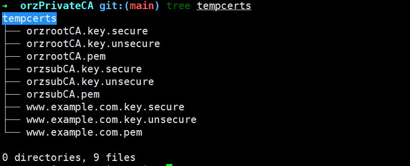
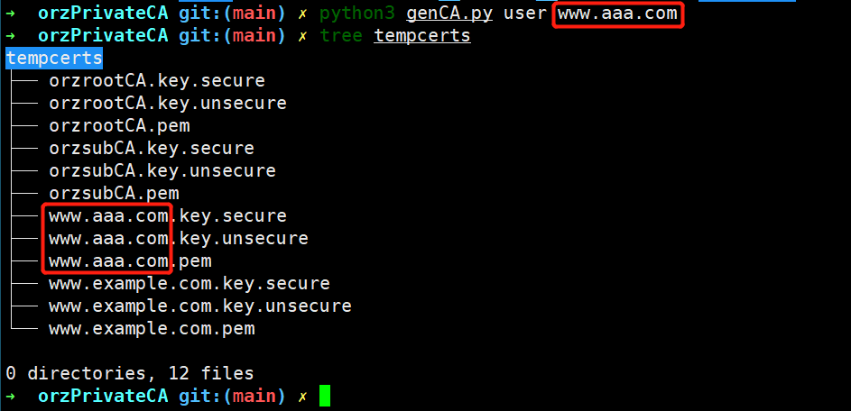

# 介绍
支持创建一个二级CA与用此二级CA签发的站点证书；
支持使用certs/目录下的二级CA创建一个测试用的站点证书
certs 目录下保存了一份二级CA（root CA: orzrootCA.pem、orzrootCA.key; sub CA: orzsubCA.pem、orzsubCA.key）和一份站点证书

# 使用
## 创建私有CA
```python3
python3 genCA.py ca
```
执行后将创建 tempcerts 目录并将创建的二级CA和站点证书保存在该目录


## 签发证书
```python3
python3 genCA.py user www.aaa.com
```

# 参考
[openssl cookbook - Creating a Private Certification Authority](https://www.feistyduck.com/library/openssl-cookbook/online/ch-openssl.html#openssl-private-ca)
